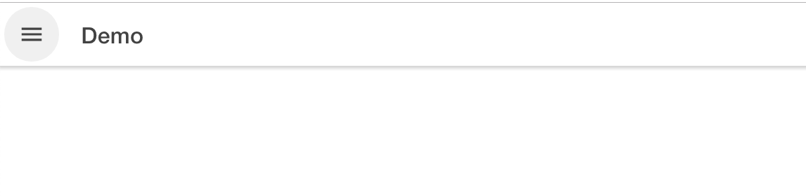

# Workshop Enrichment: Day 1

## 1. Installation

### Visual Studio Code

### NodeJS

[Download von NodeJS](https://nodejs.org/en/download/) from `https://nodejs.org/en/download`

### Ionic and Angular

[Installation von Ionic](https://ionicframework.com/docs/installation/cli)

```bash
npm -g install ionic
npm -g install @angular/cli
```

### Android Studio

## 2. Einführung

### Beispielanwendungen

-   Sidemenu
-   Tabs
-   My-First-App
-   Conference

#### Aufruf von `ionic start`

```bash
$ ionic start --help

  ionic start - Create a new project

    This command creates a working Ionic app. It installs dependencies for you and sets up your project.

    Running ionic start without any arguments will prompt you for information about your new project.

    The first argument is your app's name. Don't worry--you can always change this later. The --project-id is generated
    from name unless explicitly specified.

    The second argument is the template from which to generate your app. You can list all templates with the --list
    option. You can also specify a git repository URL for template, in which case the existing project will be cloned.

    Use the --type option to start projects using older versions of Ionic. For example, you can start an Ionic 3 project
    with --type=ionic-angular. Use --list to see all project types and templates.

  Usage:

    $ ionic start <name> <template> [options]

  Inputs:

    name ............................ The name of your new project (e.g. myApp, "My App")
    template ........................ The starter template to use (e.g. blank, tabs; use --list to see all)

  Options:

    --list, -l ...................... List available starter templates
    --type=<type> ................... Type of project to start (e.g. angular, react, ionic-angular, ionic1)
    --cordova ....................... Include Cordova integration
    --capacitor ..................... (experimental) Include Capacitor integration
    --id=<id> ....................... Specify an Ionic App ID to link

  Advanced Options:

    --no-deps ....................... Do not install npm/yarn dependencies
    --no-git ........................ Do not initialize a git repo
    --link .......................... Connect your new app to Ionic
    --project-id=<slug> ............. Specify a slug for your app (used for the directory name and package name)
    --package-id=<id> ............... Specify the bundle ID/application ID for your app (reverse-DNS notation)

  Examples:

    $ ionic start
    $ ionic start --list
    $ ionic start myApp
    $ ionic start myApp blank
    $ ionic start myApp tabs --cordova
    $ ionic start myApp tabs --capacitor
    $ ionic start myApp super --type=ionic-angular
    $ ionic start myApp blank --type=ionic1
    $ ionic start cordovaApp tabs --cordova
    $ ionic start "My App" blank
    $ ionic start "Conference App" https://github.com/ionic-team/ionic-conference-app
```

#### Liste aller Starter Templates

```bash
$ ionic start --list

Starters for @ionic/angular (--type=angular)

name         | description
--------------------------------------------------------------------------------------
tabs         | A starting project with a simple tabbed interface
sidemenu     | A starting project with a side menu with navigation in the content area
blank        | A blank starter project
my-first-app | An example application that builds a camera with gallery
conference   | A kitchen-sink application that shows off all Ionic has to offer


Starters for @ionic/react (--type=react)

name       | description
------------------------------------------------------------------------------------
blank      | A blank starter project
sidemenu   | A starting project with a side menu with navigation in the content area
tabs       | A starting project with a simple tabbed interface
conference | A kitchen-sink application that shows off all Ionic has to offer


Starters for Ionic 2/3 (--type=ionic-angular)

name     | description
----------------------------------------------------------------------------------------------------------------
tabs     | A starting project with a simple tabbed interface
sidemenu | A starting project with a side menu with navigation in the content area
blank    | A blank starter project
super    | A starting project complete with pre-built pages, providers and best practices for Ionic development.
tutorial | A tutorial based project that goes along with the Ionic documentation
aws      | AWS Mobile Hub Starter


Starters for Ionic 1 (--type=ionic1)

name     | description
---------------------------------------------------------------------------------------------
tabs     | A starting project for Ionic using a simple tabbed interface
sidemenu | A starting project for Ionic using a side menu with navigation in the content area
blank    | A blank starter project for Ionic
maps     | An Ionic starter project using Google Maps and a side menu
```

### Beispielanwendung: Sidemenu

#### Anwendung erstellen

```bash
$ ionic start --no-link --no-git --no-deps App-Sidemenu sidemenu
[INFO] Existing git project found
       (/CLOUD/Development.Enrichment/Repositories.FromGithub/repositories/enrichment-toolbox/Workshop-Enrichment_Day-01).
       Git operations are disabled.
✔ Preparing directory ./App-Sidemenu - done!
✔ Downloading and extracting sidemenu starter - done!


[INFO] Next Steps:

       - Go to your newly created project: cd ./App-Sidemenu
       - Run ionic serve within the app directory to see your app
       - Build features and components: https://ion.link/scaffolding-docs
       - Get Ionic DevApp for easy device testing: https://ion.link/devapp
```

#### Abhängigkeiten installieren

```bash
$ yarn install
yarn install v1.17.3
warning ../../../../package.json: No license field
info No lockfile found.
[1/4] 🔍  Resolving packages...
[2/4] 🚚  Fetching packages...
[3/4] 🔗  Linking dependencies...
[4/4] 🔨  Building fresh packages...
success Saved lockfile.
✨  Done in 727.19s.
```

### Anwendung starten: Howto

```bash
ionic start
$ ionic serve --help

  ionic serve - Start a local dev server for app dev/testing

    Easily spin up a development server which launches in your browser. It watches for changes in your source files and
    automatically reloads with the updated build.

    By default, ionic serve boots up a development server on all network interfaces and prints the external address(es)
    on which your app is being served. It also broadcasts your app to the Ionic DevApp on your network. To disable the
    DevApp and bind to localhost, use --local.

    Try the --lab option to see multiple platforms at once.

    ionic serve uses the Angular CLI. Use ng serve --help to list all Angular CLI options for serving your app. See the
    ng serve docs[1] for explanations. Options not listed below are considered advanced and can be passed to the Angular
    CLI using the -- separator after the Ionic CLI arguments. See the examples.

    The dev server can use HTTPS via the --ssl option (experimental). There are several known issues with HTTPS. See
    issue #3305[2].

    [1]: https://angular.io/cli/serve
    [2]: https://github.com/ionic-team/ionic-cli/issues/3305

  Usage:

    $ ionic serve [options]

  Options:

    --ssl ........................... [ng] (experimental) Use HTTPS for the dev server
    --prod .......................... [ng] Flag to use the production configuration
    --no-livereload ................. Do not spin up dev server--just serve files
    --no-open ....................... Do not open a browser window
    --lab, -l ....................... Test your apps on multiple platform types in the browser

  Advanced Options:

    --consolelogs ................... [ng] Print app console logs to the terminal
    --consolelogs-port=<port> ....... [ng] Use specific port for console logs server
    --configuration=<conf> .......... [ng] Specify the configuration to use.
    --source-map .................... [ng] Output sourcemaps
    --address=<address> ............. Use specific address for the dev server (default: localhost)
    --port=<port>, -p=? ............. Use specific port for HTTP (default: 8100)
    --devapp ........................ Publish DevApp service
    --lab-host=<host> ............... Use specific address for Ionic Lab server (default: localhost)
    --lab-port=<port> ............... Use specific port for Ionic Lab server (default: 8200)
    --browser=<browser>, -w=? ....... Specifies the browser to use (safari, firefox, google chrome)
    --browseroption=<path>, -o=? .... Specifies a path to open to (/#/tab/dash)

  Examples:

    $ ionic serve
    $ ionic serve --local
    $ ionic serve --lab
    $ ionic serve -- --proxy-config proxy.conf.json
```

#### Beispielanwendung starten

```bash
$ ionic serve --consolelog --port 4000
> ng run app:serve --host=localhost --port=4000
[ng] ℹ ｢wds｣: Project is running at http://localhost:4000/webpack-dev-server/
[ng] ℹ ｢wds｣: webpack output is served from /
[ng] ℹ ｢wds｣: 404s will fallback to //index.html
[ng] chunk {common} common.js, common.js.map (common) 26.8 kB  [rendered]
[ng] chunk {core-js-js} core-js-js.js, core-js-js.js.map (core-js-js) 78.7 kB  [rendered]
[ng] chunk {css-shim-3ea8955c-3ea8955c-js} css-shim-3ea8955c-3ea8955c-js.js, css-shim-3ea8955c-3ea8955c-js.js.map (css-shim-3ea8955c-3ea8955c-js) 20.7 kB  [rendered]
[ng] chunk {css-shim-js} css-shim-js.js, css-shim-js.js.map (css-shim-js) 20.7 kB  [rendered]
...
[ng] chunk {swiper-bundle-8d61f7c5-js} swiper-bundle-8d61f7c5-js.js, swiper-bundle-8d61f7c5-js.js.map (swiper-bundle-8d61f7c5-js) 175 kB  [rendered]
[ng] chunk {tap-click-b300ec79-js} tap-click-b300ec79-js.js, tap-click-b300ec79-js.js.map (tap-click-b300ec79-js) 6.37 kB  [rendered]
[ng] chunk {vendor} vendor.js, vendor.js.map (vendor) 4.79 MB [initial] [rendered]
[ng] Date: 2019-08-22T06:15:34.270Z - Hash: f0a125da71cbf68dc768 - Time: 29072ms
[INFO] ... and 78 additional chunks
[ng] ℹ ｢wdm｣: Compiled successfully.

[INFO] Development server running!

       Local: http://localhost:4000

       Use Ctrl+C to quit this process

[INFO] Browser window opened to http://localhost:4000!

```


### Weitere Beispielanwendungen erstellen

```bash
ionic start App-Tabs       tabs         --no-link --no-git --no-deps
ionic start App-MyFirstApp my-first-app --no-link --no-git --no-deps
ionic start App-conference conference   --no-link --no-git --no-deps
```

## 3. Erste Schritte: Ionic Entwicklungsumgebung

### Installation einer Beispielanwendung als Basis für unsere ersten Schritte.

```bash
$ ionic start App-FirstSteps sidemenu --no-git --no-deps --no-link
<Some Output>
```

```bash
$ yarn install
yarn install v1.17.3
info No lockfile found.
[1/4] 🔍  Resolving packages...
info There appears to be trouble with your network connection. Retrying...
[2/4] 🚚  Fetching packages...
[3/4] 🔗  Linking dependencies...
```

```bash
$ ionic serve --port 4001
> ng run app:serve --host=localhost --port=4001
```

### Verzeichnisstruktur Structure


### Komponenten

## 4. Erste Schritte: Web

### WebDesign in 5 Minutes

### Seiten erstellen

```bash
ng generate page pages/webdesign/WebDesignStep1
ng generate page pages/webdesign/WebDesignStep2
ng generate page pages/webdesign/WebDesignStep3
ng generate page pages/webdesign/WebDesignStep4
ng generate page pages/webdesign/WebDesignStep5
```

## 5. Erste Schritte: Ionic

## 6. Anpassen der Beispielanwendungen

### 6.1. Neue Seite erstellen

```bash
$ ionic g page demo
> ng generate page demo
CREATE src/app/demo/demo.module.ts (533 bytes)
CREATE src/app/demo/demo.page.scss (0 bytes)
CREATE src/app/demo/demo.page.html (123 bytes)
CREATE src/app/demo/demo.page.spec.ts (677 bytes)
CREATE src/app/demo/demo.page.ts (248 bytes)
UPDATE src/app/app-routing.module.ts (670 bytes)
[OK] Generated page!
```

Das Menü sieht dann wie folgt aus:

{:width=50px}

### 6.2 Route zu der neuen Seite

Zusätzlich wurde ein Weg zu dieser Seite konfiguriert:

```bash
const routes: Routes = [
    { path: '', redirectTo: 'home', pathMatch: 'full' },
    { path: 'home', loadChildren: () => import('./home/home.module').then(m => m.HomePageModule) },
    { path: 'list', loadChildren: () => import('./list/list.module').then(m => m.ListPageModule) },
    { path: 'demo', loadChildren: './demo/demo.module#DemoPageModule' }
];
```

### 6.3. Seite zum Menu hinzufügen

Wir erweitern die Liste der Seiten in der Datei `app.components.ts`

```bash
export class AppComponent {
    public appPages = [
        { title: 'Home', url: '/home', icon: 'home' },
        { title: 'List', url: '/list', icon: 'list' },
        { title: 'Demo', url: '/demo', icon: 'create' }
    ];
```

Ein schönes Icon finden wier hier: https://ionicons.com


### 6.4. Auf der neuen Seite das Menu hinzufügen

Schauen wir einfach nach, wie es auf der Seite `list` gemacht wird:

```html
<ion-header>
    <ion-toolbar
        ><ion-buttons slot="start"
            ><ion-menu-button></ion-menu-button
        ></ion-buttons>
        <ion-buttons slot="start">
            <ion-menu-button></ion-menu-button>
        </ion-buttons>
        <ion-title>List</ion-title>
    </ion-toolbar>
</ion-header>
```

Entsprechend ändern wir daher den Inhalt der Datei `demo.page.html`:

```html
<ion-header>
    <ion-toolbar
        ><ion-buttons slot="start"
            ><ion-menu-button></ion-menu-button></ion-buttons></ion-toolbar
></ion-header>
```

```html
<ion-buttons slot="start">
    <ion-menu-button></ion-menu-button>
</ion-buttons>
```

```html
        <ion-title>Demo</ion-title>
    </ion-toolbar>
</ion-header>
```



### Text ändern

Wir erweitern nun die Demoseite um eigenen Inhalt.

Dazu fügen wir den nachfolgenden Programmcode in die Datei `demo.page.html`ein:

```html
<ion-content>
    <h1>Überschrift - Ebene 1</h1>
    <h2>Überschrift - Ebene 2</h2>
    <h3 style="color: blue">Überschrift - Ebene 3</h3>

    <p>Hier steht gehts zur <a href="/list">Liste</a></p>

    <button>Drück mich!</button>

    <div class="container">
        <div class="spalte warning">Achtung!</div>
        <div class="spalte" id="box2">Box 2</div>
        <div class="spalte" id="box3">Box 3</div>
    </div>
</ion-content>
```


### Aussehen ändern

```css
#box2 {
    background-color: lightgray;
}

.warning {
    margin-left: auto;
    margin-right: auto;

    color: red;
}

.container {
    width: 100%;
    height: 100px;
    border: 1px solid;
    padding: 1em;
}

.spalte {
    width: 30%;
    height: calc(100% - 5px);
    border: 1px solid green;
    margin: 0 2px;
    padding: 1em;
    float: left;
}
```


## Alle Seiten der DemoApp erstellen

```bash
    ionic generate page pages/css/level1/CSSDemo101
    ionic generate page pages/css/level1/CSSDemo102
    ionic generate page pages/css/level1/CSSDemo103
    ionic generate page pages/css/level1/CSSDemo104
    ionic generate page pages/css/level1/CSSDemo105

    ionic generate page pages/css/level2/CSSDemo201
    ionic generate page pages/css/level2/CSSDemo202
    ionic generate page pages/css/level2/CSSDemo203
    ionic generate page pages/css/level2/CSSDemo204
    ionic generate page pages/css/level2/CSSDemo205

    ionic generate page pages/html/level1/HTMLDemo101
    ionic generate page pages/html/level1/HTMLDemo102
    ionic generate page pages/html/level1/HTMLDemo103
    ionic generate page pages/html/level1/HTMLDemo104
    ionic generate page pages/html/level1/HTMLDemo105

    ionic generate page pages/html/level2/HTMLDemo201
    ionic generate page pages/html/level2/HTMLDemo202
    ionic generate page pages/html/level2/HTMLDemo203
    ionic generate page pages/html/level2/HTMLDemo204
    ionic generate page pages/html/level2/HTMLDemo205
´´´
```
